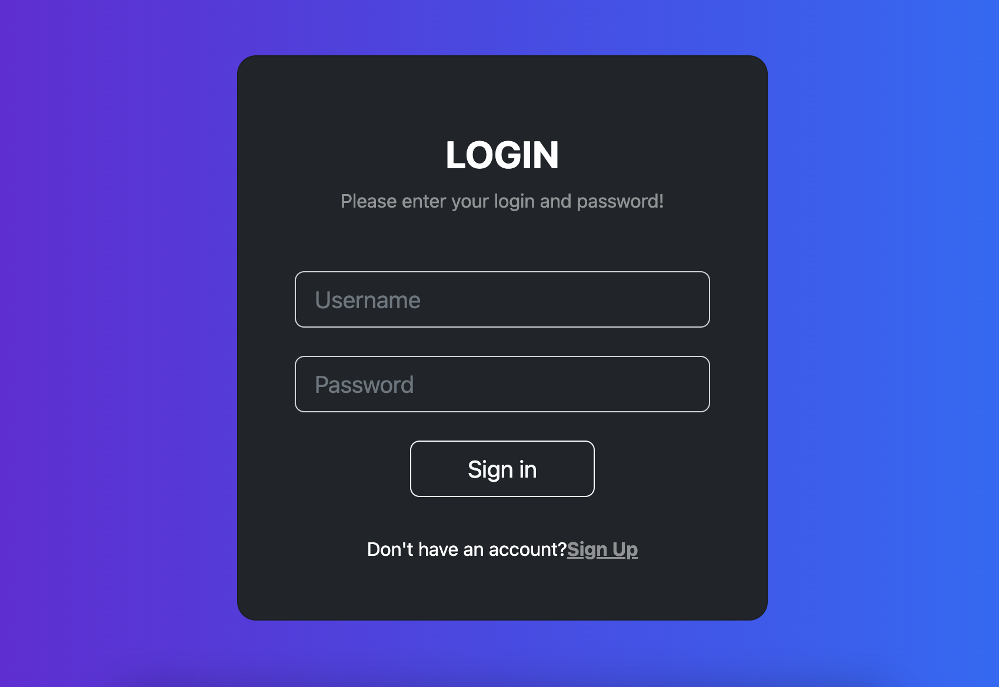
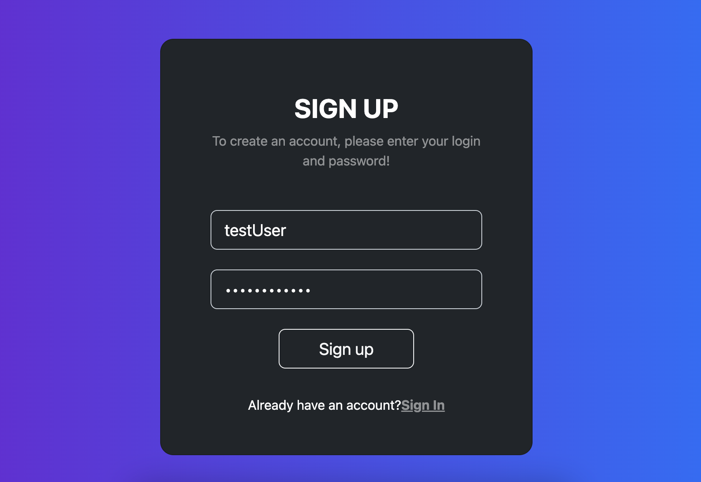
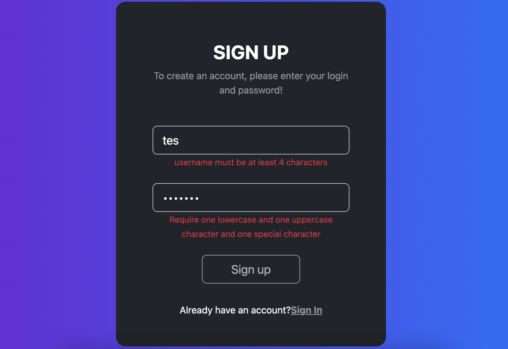
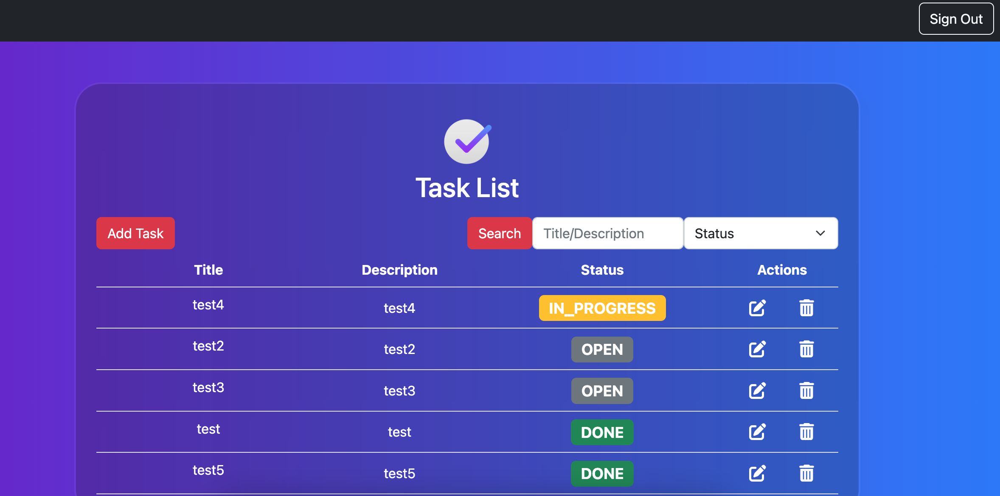
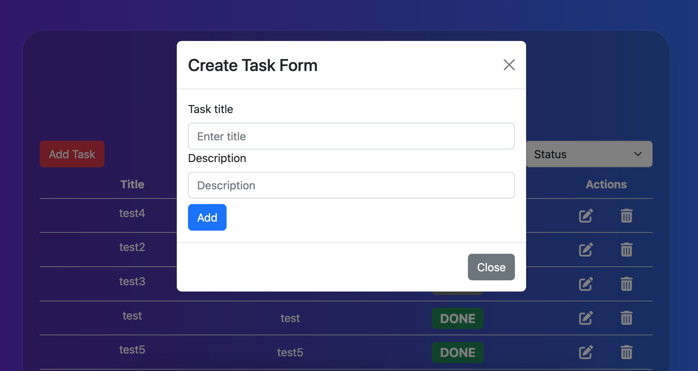
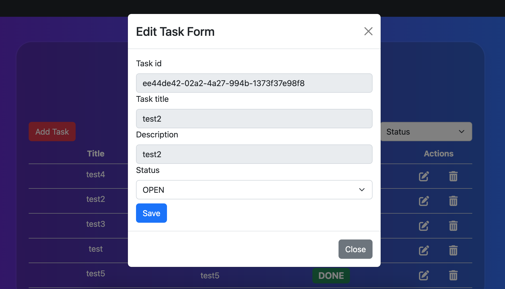
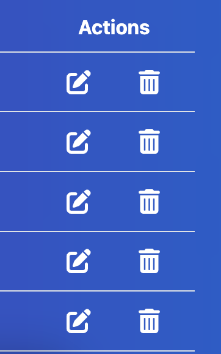
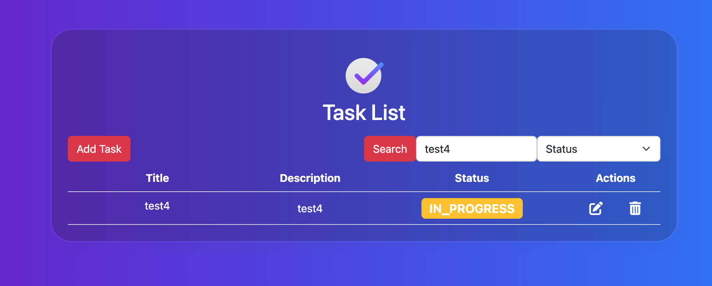

## `Task-management-react`

This service is front-end representation of nest-task-management-next-gen available under
[https://github.com/Nicram97/nest-task-management-next-gen](https://github.com/Nicram97/nest-task-management-next-gen)

### `npm start`

Runs the app in the development mode.\
Open [http://localhost:3000](http://localhost:3000) to view it in the browser.

The page will reload if you make edits.\
You will also see any lint errors in the console.

### `npm test`

Launches the test runner in the interactive watch mode.\

### `App Overview`

App consists from a few simple components which combines into "To do" react based app with backend
authentication using JWT. User can signin/out of the app. Then after being navigated to dashboard panel, he
can add/update/delete tasks, search them with title/description or/and task status (Open, In progress and Done).

#### `Tech Stack`
* TypeScript
* React 18
* Bootstrap
* React-bootstrap
* JWT tokens
* React-router

#### `Login Page`

From login/main page user can sigIn to existing account or using "Sign up" clickable text navigate to create account page.

#### `Registration Page`

On this page user can create account. On Username/password change user will be provided with messages under inputs if name or passwords passes security standard.

#### `Dashboard`

This page represents heart of the app. Here user can create, search, edit and delete tasks.

If it is requested user can log out from app clicking button in the right top corner. On successful logout app navigates back to login page.

##### `Add Task`

When user clicks Add Task modal with proper form will appear in the middle of the screen.

After filling in the form and clicking Add request to backend is sent to add task to database. If error is returned it will appear inside of mentioned modal. If everything went correctly modal will close and new task will be added to existing list.

##### `Edit Task`

For testing purpose app was designed to allow only task status update. Rest of the properties are disabled (can be easily enabled on backend and frontend side).

To update task just click first icon from left in action section.

Upon saving changes PATCH request is sent to backend. If error appears it will be presented properly. If not modal will close and task will be updated.

##### `Delete Task`

To delete task simply lick thrash icon in actions section.

##### `Search Tasks`

To perform search operation fill top input with text which You want to look in description and title or/and select what type of status to look for in tasks. Next click Search and result will be presented on the screen

This project was made as exercise on frontend with React.